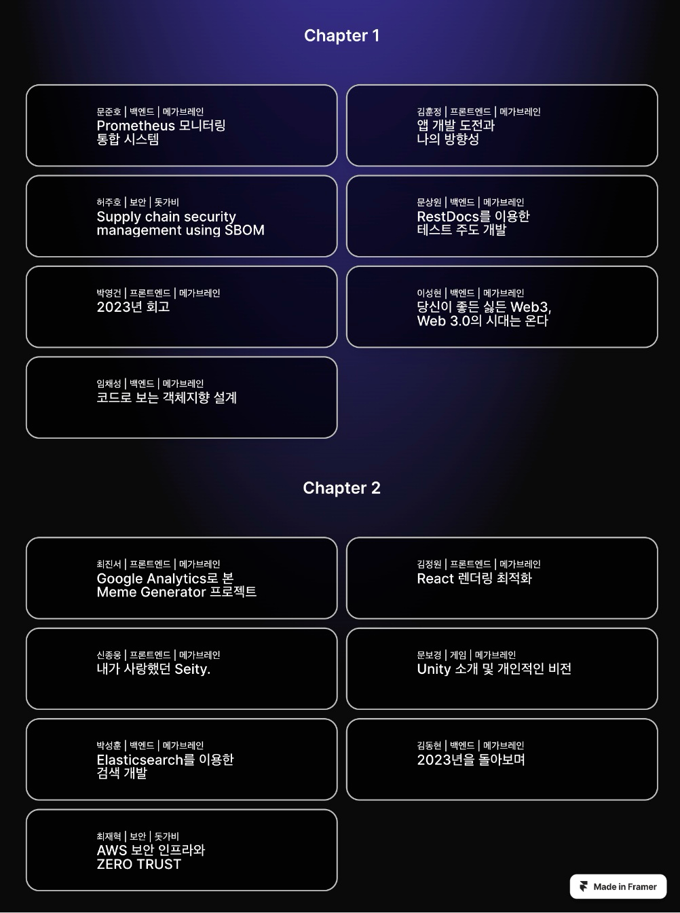

# 메가콘 2023

## 발표 세션

## 발표 자료

# 2023년을 돌아보며

| 순서 | 제목 | 발표자 | 발표 영상 | 발표자료
|---:| :--- | :---: | :---: | :---: |
|  1 | 2023년을 돌아보며 | 김동현 | [유튜브](https://youtu.be/nhtwwhB72PI?si=TdgGTm1X0lykYdU_) | [다운로드](https://docs.google.com/presentation/d/1yp0mAaSf7eEEvi6g5c0lJPgOjcpywoe5/edit?usp=drive_link&ouid=117719804488263619306&rtpof=true&sd=true) |
|  2 | 앱 개발 도전과 나의 방향성 | 김훈정 | 유튜브 | [다운로드](https://drive.google.com/file/d/1Tp0HBuMma9PhIiXLYOQUS1LszW6tOkfz/view?usp=drive_link) |
|  3 | Supply chain security management using SBOM | 허주호 | 유튜브 | [다운로드](https://drive.google.com/file/d/1vIEkwgk4K-0LDI_kvTtAk10uGK6l_kW9/view?usp=drive_link) |
|  4 | RestDocs를 이용한 테스트 주도 개발 | 문상원 | [유튜브](https://youtu.be/3egAqUDNCmk?si=biuHoX-DPQRP8MgT) | [다운로드](https://docs.google.com/presentation/d/16mIxn3qPwMDdaNo1qFW6c1W4QbsVuHyN/edit?usp=drive_link&ouid=117719804488263619306&rtpof=true&sd=true) |
|  5 | 2023년 회고 | 박영건 | [유튜브](https://youtu.be/7yHzP3D9wEY?si=NORfDf8OSZNxYTcl) | [다운로드](https://docs.google.com/presentation/d/17X-KQ_WHAz3GJYkPwXmwMdLDgffJuYJS/edit?usp=drive_link&ouid=117719804488263619306&rtpof=true&sd=true) |
|  6 | 내가 사랑했던 Seity. | 신종웅 | [유튜브](https://youtu.be/6Tqr8TpVzJk?si=B_ozfzExyCY0GoSW) | [다운로드](https://drive.google.com/file/d/1fyc7DV-8WkE1na2N7tRY8C7r6fC7sSqX/view?usp=drive_link) |
|  7 | 코드로 보는 객체지향 설계 | 임채성 | [유튜브](https://youtu.be/lHdbg-FwFNs?si=YrW8zjs4IgXMAPEb) | [다운로드](https://drive.google.com/file/d/1_0hA8-ZWzKDI9IFN3YfB9xF6HyLiNr6J/view?usp=drive_link) |
|  8 | Google Analytics로 본 Meme Generator 프로젝트 | 최진서 | [유튜브](https://youtu.be/CkWEOASKVW4?si=ibaEZ6KfV_Jm3i3-) | [다운로드](https://docs.google.com/presentation/d/1NmqnfFDQp3fyl0eZU9LbzgGDUF2ycuvZ/edit?usp=drive_link&ouid=117719804488263619306&rtpof=true&sd=true) |
|  9 | React 렌더링 최적화 | 김정원 | [유튜브](https://youtu.be/45IKzHlNFzM?si=D2fVEi8B5ZsP307J) | [다운로드](https://docs.google.com/presentation/d/1nVJdYLYFW5XQkxcg8qYhYeWgZ450kXdq/edit?usp=drive_link&ouid=117719804488263619306&rtpof=true&sd=true) |
| 10 | 당신이 좋든 싫든 Web3, Web 3.0의 시대는 온다 | 이성현 | [유튜브](https://youtu.be/l57tZ5LNPE0?si=PLSVJOJCgxPQy3Yl) | [다운로드](https://drive.google.com/file/d/1gRynwI9QvbGOkt9Wtzar7pA4JO5XTVMb/view?usp=drive_link) |
| 11 | Unity 소개 및 개인적인 비전 | 문보경 | [유튜브](https://youtu.be/l0DPb2wk0WI?si=ugCeTHxk0EyNdwbE) | [다운로드](https://drive.google.com/file/d/1bWZVmN2iw5eCHFY_GuqcEHzDpus6lRvW/view?usp=drive_link) |
| 12 | ElasticSearch를 이용한 검색 개발 | 박성훈 | [유튜브](https://youtu.be/CkWEOASKVW4?si=vlIpSUdWnvy09qWC) | [다운로드](https://docs.google.com/presentation/d/1LeZg06DWlbvfAfpk2TZblBDBVs-66UaT/edit?usp=drive_link&ouid=117719804488263619306&rtpof=true&sd=true) |
| 13 | Prometheus 모니터링 통합 시스템 | 문준호 | [유튜브](https://youtu.be/mpjeY_g1h6w?si=CKvu4BTVQ3KB3Zpo) | [다운로드](https://docs.google.com/presentation/d/1JCjIwS0hCK9TmL-bpioBvezak-dY5mxf/edit?usp=drive_link&ouid=117719804488263619306&rtpof=true&sd=true) |
| 14 | AWS보안 인프라와 ZERO TRUST | 최재혁 | [유튜브](https://youtu.be/1UDTeOAKYzU?si=-sYSJNWSSCeZujJV) | [다운로드](https://drive.google.com/file/d/1cEt8Ra8tH_7Pgu5dWDWjATDhcvGYn-E3/view?usp=drive_link) |
