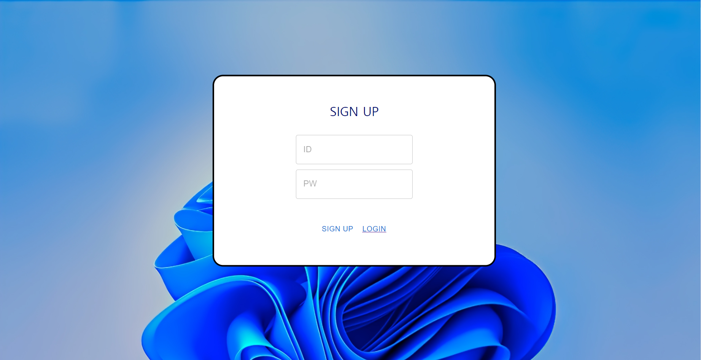
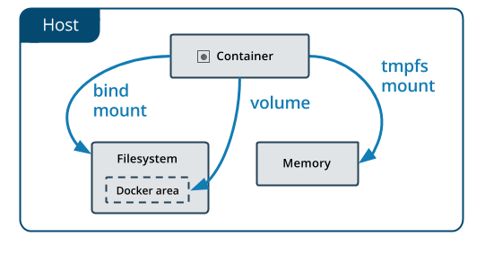

import ReactPlayer from "react-player";

# 메가톤 2023
행사 기간: 2023.02.04.14:00 ~ 2023.02.05.14:00

## Mega-OS팀

### 프로젝트 소개
M-OS는 리눅스를 많이 사용하는 사람들에게 ‘파일 관리’를 윈도우처럼 UI로 편하게 제공하고자 만들게 된 웹OS입니다.

### 참여자
- 문준호
- 이성현
- 이나린
- 이병진

### 주요 기능
- 파일 및 폴더 생성, 이동, 삭제
- 파일 업로드 및 다운로드
- 확장자에 맞는 창
- 화면 드래그 영역 및 컴포넌트 선택
- 마우스 우클릭
- 창 크기 조절
- Docker를 이용한 파일 관리
- 도커 볼륨을 이용해 디렉토리 및 파일들을 관리
- 마인트 바운드를 통해 외부 저장소와 연동하여 저장
 

### 결과물

<ReactPlayer playing controls url={require('./static/2023/team1-working1.mov').default}/>
<ReactPlayer playing controls url={require('./static/2023/team1-working2.mov').default}/>

- [백엔드 Github](https://github.com/inje-megabrain/Mos-be)
- [프론트엔드 Github](https://github.com/inje-megabrain/Mos-fe)

---

## (백엔드>프론트) 팀

### 프로젝트 소개
인제대학교 학우들을 위한 편의성 애플리케이션을 개발하였습니다.

### 참여자
- 문상원
- 신종웅
- 임채성

### 주요 기능
- 학식 조회
- 학과 공지 조회
- 학사 일정 조회
- 교내 버스 및 학교 근처 버스 조회

### 결과물
<ReactPlayer playing controls url={require('./static/2023/team2-working.mov').default}/>

- [프론트엔드 Github](https://github.com/inje-megabrain/IJS-FE)
- [백엔드 Github](https://github.com/inje-megabrain/inje-megabrain-IJS-BE)
- [크롤러 Github](https://github.com/inje-megabrain/IJS-BE-CRAWLING)

