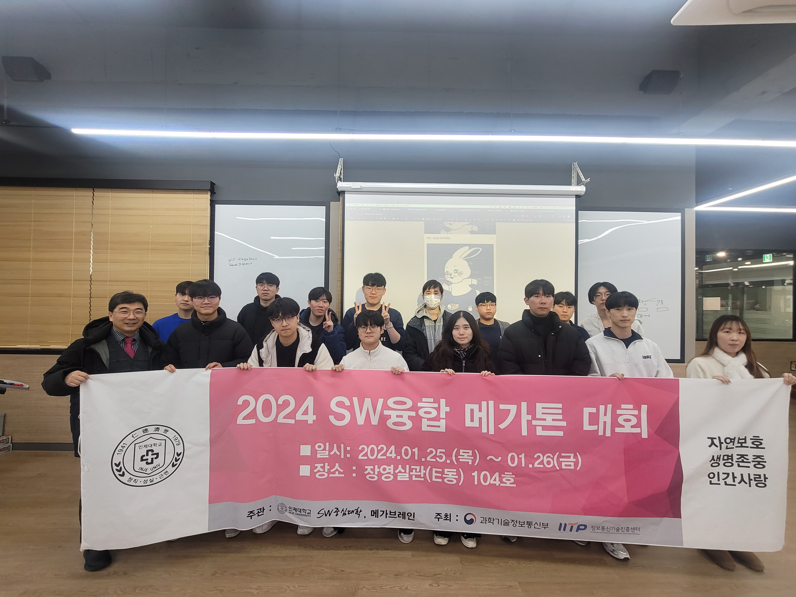
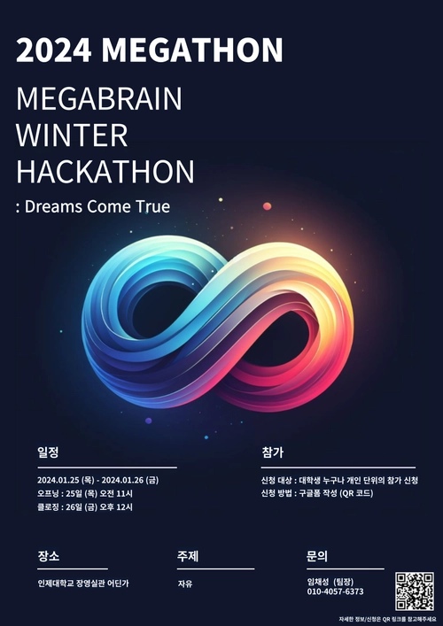

# 메가톤 2024

<h2>메가톤 2024</h2>

메가브레인 동아리는 지난 1월 25~26일 (무박 2일) 동안 **2024 메가브레인 해커톤** 행사를 성공적으로 개최했습니다.
동아리원들과 컴퓨터 공학과 학생들이 처음 만나는 낯섦을 극복하고 열정으로 하나가 되어 프로젝트를 완성해 나갔던 경험은 매우 의미 있었습니다.

이번 해커톤을 통해 참가자들은 팀원들과 함께 아이디어를 모색하고, 협력하여 실제 업무 경험과 지식을 습득하는 등 여러 면에서 성장할 기회를 가졌습니다.

메가브레인 동아리는 앞으로도 이러한 기회를 꾸준히 제공함으로써 학생들이 만나는 장을 마련하고, 함께 성장하며 서로를 발전시키는 데 기여할 계획입니다.

- 소프트웨어 중심 사업단의 지원을 받아 진행되었습니다.

---
### 해커톤 사진

    
    
    
    
    
    
    
    

---
### 프로젝트 발표

    
    
    
    

---

### 행사 포스터

- 주관: 메가브레인
- 진행 시간: 2024년 1월 25일(목) 오전 11시 ~ 26일 (금) 오전 10시
- 장소: 인제대학교 E동 104(버디버디실), 105 호
- 주제: 자유 주제
- 프로그램: 팀 빌딩, 프로젝트 구현 및 평가
- 담당자 : 임채성(팀장) puleugo@gmail.com, 김동현 (부팀장) haroya0117@gmail.com

